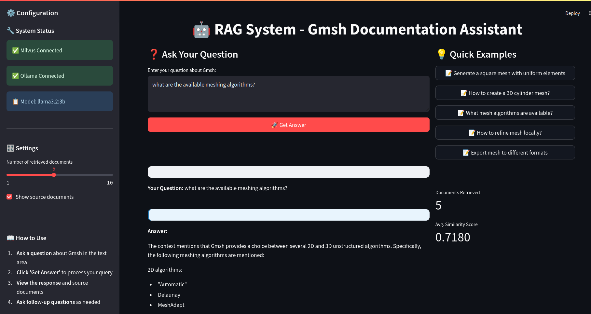

# RAG System for Gmsh Documentation

A Retrieval-Augmented Generation (RAG) system that creates a searchable knowledge base from text documents and provides an interactive Streamlit interface for querying information using Ollama LLM and Milvus vector database.

## System Architecture

The system consists of two main components:
- **vdb_gen.py**: Creates and populates a Milvus vector database from input text
- **app.py**: Provides a Streamlit web interface for querying the knowledge base

## Prerequisites

### Required Services
- **Milvus**: Vector database (default port 19530)
- **Ollama**: Local LLM server (default port 11434) with llama3.2:3b model

### Python Dependencies
```bash
pip install streamlit sentence-transformers pymilvus requests nltk numpy
```

## Setup Instructions

### 1. Install and Start Required Services

**Milvus Installation:**
Follow the official instruction [here](https://milvus.io/docs/prerequisite-docker.md).

**Ollama Installation:**
```bash
curl -fsSL https://ollama.ai/install.sh | sh

ollama serve

ollama pull llama3.2:3b
```

or see the the official page [here](https://ollama.com/download).

### 2. Prepare Your Data
Place your input text file at `./data/doc.txt` or modify the `INPUT_TEXT_FILE` path in `vdb_gen.py`.

### 3. Create Vector Database
```bash
python vdb_gen.py
```

This will:
- Read the input text file
- Split text into chunks
- Generate embeddings using SentenceTransformer
- Create and populate Milvus collection
- Create search index

### 4. Launch Streamlit Application
```bash
streamlit run app.py
```



## Configuration

### Key Parameters (vdb_gen.py)
- `INPUT_TEXT_FILE`: Path to your input text document
- `MILVUS_COLLEC_NAME`: Name of the Milvus collection
- `chunk_size`: Number of sentences per text chunk (default: 5)

### Key Parameters (app.py)
- `OLLAMA_BASE_URL`: Ollama server URL (default: http://127.0.0.1:11434)
- `OLLAMA_MODEL`: Model name (default: llama3.2:3b)
- `TOP_K_RESULTS`: Number of similar documents to retrieve (default: 5)

## Usage

1. **Create Knowledge Base**: Run `vdb_gen.py` to process your documents
2. **Start Web Interface**: Launch the Streamlit app with `streamlit run app.py`
3. **Ask Questions**: Use the web interface to query your knowledge base
4. **View Results**: Get AI-generated answers with source document references

## Features

- **Document Preprocessing**: Automatic text chunking and embedding generation
- **Semantic Search**: Find relevant documents using vector similarity
- **LLM Integration**: Generate contextual answers using retrieved documents
- **Interactive Interface**: User-friendly Streamlit web application
- **Source Attribution**: View source documents used for each answer
- **System Monitoring**: Real-time status of Milvus and Ollama connections

## File Structure

```
project/
├── vdb_gen.py          # Vector database creation script
├── app.py              # Streamlit web application
├── data/
│   └── doc.txt         # Input text document
└── logs/               # Application logs (auto-created)
```

## License

This project is provided as-is for educational and research purposes.